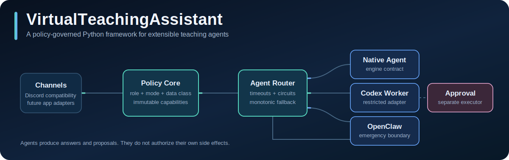
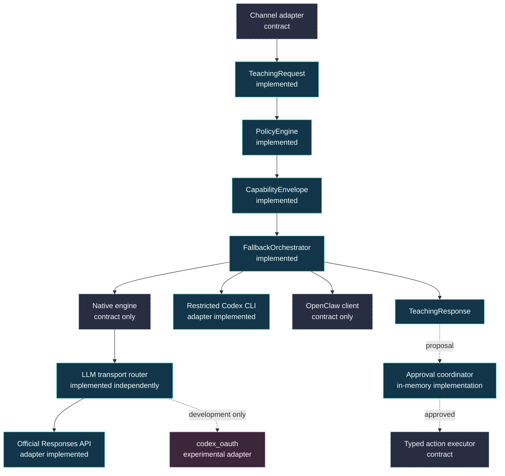

<p align="center">
  
</p>

<p align="center">
  <a href="https://github.com/zeron-G/VirtualTeachingAssistant/actions/workflows/ci.yml"></a>
  
  
  <a href="LICENSE"></a>
</p>

<p align="center">
  <strong>Policy-governed teaching agents, designed as a Python framework rather than a single chatbot.</strong>
</p>

VirtualTeachingAssistant is an open-source **Python framework and reference
implementation for building extensible, course-aware teaching-agent systems**.
It separates educational behavior from communication channels, model providers,
agent runtimes, institutional policy, and side-effect execution so that each can
evolve without turning one bot integration into the architecture of the whole
system.

The project is being designed for a possible future Carey Business School
teaching environment, but it is not a Carey or Johns Hopkins product and has not
been institutionally approved. Its architecture is intentionally broader than
Discord, OpenClaw, or one course: those are adapters and migration inputs around
a Python domain and orchestration core.

> [!IMPORTANT]
> This repository currently contains a tested platform foundation and a legacy
> OpenClaw deployment compatibility layer. It is **not** a production-ready
> student service. The [current-state inventory](docs/architecture/current-state.md)
> identifies every implemented, contract-only, compatibility, planned, and
> institution-dependent component.

## Why this project exists

Most teaching bots bind four concerns together: the chat surface, the LLM, the
course integration, and the permissions granted to the bot. That is convenient
for a prototype and difficult to govern as soon as the system can see student
data, answer across multiple courses, or propose actions in Canvas.

VirtualTeachingAssistant uses a different decomposition:

- **Teaching behavior is a versioned skill.** Course reasoning, evidence order,
  academic-integrity rules, and response conventions can be reviewed like code.
- **Policy precedes the agent.** Actor role, interaction mode, data class, and
  requested capability produce an immutable envelope before any backend runs.
- **Agent runtimes are replaceable.** A native engine, restricted Codex worker,
  or emergency OpenClaw backend implements the same Python protocol.
- **Fallback cannot increase authority.** A degraded backend receives the same
  or fewer capabilities and cannot inherit extra data visibility.
- **Reasoning and effects are separate systems.** Agents may answer or propose;
  approval and deterministic executors own external mutations.
- **Channels are edge adapters.** Discord is the current compatibility path,
  while a future school app, web API, or classroom event source can normalize
  into the same domain request.
- **Operations are part of the design.** Health probes, circuit breakers,
  redacted audit events, failure categories, and production configuration guards
  are platform contracts rather than afterthoughts.

## Architecture at a glance



Solid green components have executable V2 implementations. Dashed components
are typed extension contracts without a production adapter. Pink indicates a
restricted compatibility or experimental path. See the
[component model](docs/architecture/components.md) for source-level ownership.

### Request path

1. A channel adapter normalizes provider input into an immutable
   `TeachingRequest` containing tenant, course, actor, mode, data class, request
   ID, trace ID, and idempotency key.
2. `PolicyEngine` intersects role, mode, and requested capabilities. It rejects
   highly restricted input and strips all agent side effects.
3. `FallbackOrchestrator` tries eligible backends in tier order, applying each
   backend's data ceiling, timeout, and circuit breaker.
4. Only retryable authentication, rate-limit, timeout, unavailable, or internal
   failures can move to the next backend. Invalid, policy, and safety failures
   stop immediately.
5. `TeachingService` returns the answer and writes a minimized audit event with
   HMAC actor/content digests and lengths, not raw student content.
6. Any external mutation remains an `ActionProposal`. A separate approval
   coordinator and typed executor must authorize and perform it idempotently.

The complete sequence, including failure behavior, is documented in
[Request lifecycle](docs/architecture/request-lifecycle.md).

## Three agent tiers, one permission ceiling

The tier number expresses **fallback order**, not increasing trust or power.

| Tier | Role in the design | Current repository status | Automatic fallback |
|---|---|---|---|
| Native | Long-term Python-native teaching engine | Engine protocol and adapter exist; engine is not implemented | First when registered |
| Codex CLI | General reasoning worker behind a restricted subprocess boundary | Adapter implemented with stdin, ephemeral mode, ignored user config, read-only sandbox, timeout, and bounded output | Second by default |
| OpenClaw | Emergency/compatibility backend | V2 client protocol exists; original deployer can install and configure OpenClaw separately | Last when a safe client is registered |

No tier receives `discord.send`, `canvas.write`, or `config.write`. Codex
`--yolo` and `danger-full-access` are explicitly outside the architecture.

## Authentication and model transport

The model-transport layer is independent from agent selection. It supports an
ordered credential/transport router with per-transport data ceilings, timeout,
circuit state, production eligibility, and safe failure categories.

- **Production direction:** dedicated official OpenAI API credentials or an
  institution-approved service identity stored outside the repository.
- **Development experiment:**
  [`zeron-G/codex_oauth`](https://github.com/zeron-G/codex_oauth), which uses an
  unsupported ChatGPT Codex backend and local interactive authentication.
- **Important distinction:** failover is sequential recovery, not two secrets
  being combined into stronger authentication. Production configuration rejects
  the experimental OAuth transport.

See [ADR 0003](docs/adr/0003-llm-authentication.md) and
[Security](SECURITY.md) for the rationale.

## Current capability map

| Area | Status | What exists now |
|---|---|---|
| Domain model | Implemented | Immutable requests, responses, proposals, approvals, health records, roles, modes, data classes, and capabilities |
| Policy | Implemented | Role/mode intersection, data-class rules, administration guard, side-effect removal |
| Agent fallback | Implemented | Ordered routing, timeout, retry taxonomy, circuit breaker, permission/data monotonicity |
| Codex adapter | Implemented | Restricted `codex exec` command construction and JSONL result parsing |
| Native agent | Contract only | `NativeAgentEngine` protocol and wrapper, no planner/retriever/verifier engine |
| OpenClaw V2 adapter | Contract only | Safe client boundary, no production RPC client shipped |
| LLM transport | Implemented adapter | Official Responses API with `store=False`; development OAuth adapter is optional |
| Approvals | Pilot implementation | In-memory store and one/two-person approval rules; no durable transactional outbox |
| Observability | Implemented foundation | Bounded concurrent health probes, JSONL/in-memory audit sinks, redaction |
| Skills | Implemented foundation | Trusted manifest discovery plus bundled `course-ta` 2.1 policy skill |
| Channels and activities | Contract only | Registries/protocols; no V2 Discord, school-app, live-class, game, or debate runtime |
| Legacy Course TA | Compatibility | OpenClaw installation, Canvas sync/indexing, Discord allowlists, and read-only connectivity checks |
| Production platform | Planned/gated | API ingress, SSO/RBAC, durable data, secrets manager, isolated workers, metrics, alerts, and institutional review |

The authoritative, source-linked version of this table lives in
[Current state](docs/architecture/current-state.md).

## Teaching modes the framework models

The domain already names five interaction modes so future behavior does not
need to be smuggled through a generic chat endpoint:

- **Question answering:** grounded explanations, course navigation, deadlines,
  and academic-integrity-aware coaching.
- **Live class:** a bounded analysis contract for future transcript/event input;
  no live ingestion runtime exists yet.
- **Post-class recap:** a distinct draft capability for future instructor review
  and publication workflows.
- **Activity:** an extension contract for games, debates, simulations, and other
  instructor-controlled classroom activities.
- **Administration:** instructor/administrator-only reasoning that may produce
  typed proposals but still cannot directly mutate external systems.

## Python package structure

```text
virtual_teaching_assistant/
  domain/          Immutable platform language and safe error taxonomy
  ports/           Python Protocol boundaries for agents, channels, LLMs, skills,
                   approvals, actions, audit, and health
  orchestration/   Policy, circuit breaking, fallback, approvals, teaching service
  infrastructure/  Codex/OpenClaw/native adapters, auth routing, audit, probes
  activities/      Classroom activity descriptors and plugin registry
  skills/          Trusted skill manifest discovery
  runtime/         Strict environment parsing and production guardrails

course_ta_deployer/
  ...              Original OpenClaw deployment compatibility package
  skills/course-ta Versioned teaching policy and legacy Canvas helper library
```

The core dependency direction is enforced by `scripts/check_architecture.py`:
domain, ports, and orchestration cannot import infrastructure, the legacy
deployer, or network SDKs.

## Start developing

VirtualTeachingAssistant requires Python 3.11 or newer. Linux is the documented
target for the **legacy server deployment scripts**; it is not a restriction on
the Python architecture or local development model.

```bash
git clone https://github.com/zeron-G/VirtualTeachingAssistant.git
cd VirtualTeachingAssistant
python -m venv .venv

# Linux/macOS
. .venv/bin/activate

# Windows PowerShell
# .venv\Scripts\Activate.ps1

python -m pip install -e .
virtual-ta version
virtual-ta architecture
virtual-ta self-check
```

`self-check` is intentionally local and non-networked. It validates Python,
bundled skills, and enabled local executables without touching Canvas, Discord,
or a model provider.

Continue with [Getting started](docs/development/getting-started.md), then read
[Testing and quality gates](docs/development/testing.md) before changing code.

### Evaluating the compatibility deployer

The original `course-ta-deploy` flow can still install OpenClaw, install the
bundled skill, configure Canvas/Discord, and run connectivity checks. It is a
migration/sandbox path, not the V2 platform composition root.

```bash
cp .env.example .env
chmod 600 .env
./deploy.sh --dry-run
./check.sh --offline
```

Do not use real student data or production credentials in an unapproved
environment. Read [Deployment overview](docs/deployment/overview.md) and
[Legacy Linux deployment](docs/linux-server.md) first.

## Extend the framework

The extension model is based on typed Python protocols and registries:

| Extension | Primary contract | Typical implementation |
|---|---|---|
| Communication channel | `ChannelAdapter` | Discord, web API, school app, scheduled event source |
| Agent backend | `AgentBackend` | Native planner, restricted Codex worker, OpenClaw RPC client |
| Model transport | `LLMTransport` | Official API, approved enterprise gateway |
| Teaching skill | `SkillProvider` / manifest | Course policy, evidence routing, pedagogical behavior |
| Classroom activity | `ActivityPlugin` | Debate, simulation, quiz game, case exercise |
| Side effect | `ActionExecutor` | Canvas write, approved announcement, message relay |
| Operations | `HealthProbe`, `AuditSink` | Provider health, storage health, metrics/audit integration |

Each extension must declare capabilities and data limits; registering an adapter
does not grant it permission. See [Extending VTA](docs/development/extending.md)
and [Contracts reference](docs/reference/contracts.md).

## Documentation

| Start here | Purpose |
|---|---|
| [Documentation index](docs/README.md) | Reading paths for educators, engineers, reviewers, and operators |
| [Current state](docs/architecture/current-state.md) | Exact implementation inventory and known gaps |
| [Architecture overview](docs/architecture/overview.md) | Current and target architecture with trust boundaries |
| [Component model](docs/architecture/components.md) | Module ownership, dependencies, and extension points |
| [Request lifecycle](docs/architecture/request-lifecycle.md) | Success, fallback, denial, audit, and action-proposal flows |
| [Threat model](docs/architecture/threat-model.md) | Assets, adversaries, required controls, forbidden configurations |
| [Configuration reference](docs/reference/configuration.md) | V2 and compatibility environment variables and safety rules |
| [Operations](docs/operations/observability.md) | Health, audit, degradation, monitoring gaps, and runbooks |
| [Roadmap](docs/roadmap.md) | Work required from framework foundation to controlled pilot |
| [Glossary](docs/glossary.md) | Stable meanings for platform terminology |

Architecture decisions are recorded under [`docs/adr/`](docs/adr/), and scoped
engineering work is preserved under [`specs/`](specs/). Material changes are
summarized in the [changelog](CHANGELOG.md).

## Verification

```bash
python -m unittest discover -s tests -v
python -m compileall -q virtual_teaching_assistant course_ta_deployer tests scripts
python scripts/check_architecture.py
python scripts/check_docs.py
python scripts/validate_evals.py
python scripts/security_scan.py .
python -m build
```

The public test suite uses synthetic data and fake credentials. It does not make
live Canvas, Discord, OpenAI, Codex, or OpenClaw calls.

## Security and institutional boundaries

This codebase can enforce software controls; it cannot declare itself compliant
or approved. A real-course pilot requires institutional identity and RBAC,
privacy and accessibility review, data-retention policy, approved vendors and
credentials, isolated workers, durable encrypted state, incident response, and
a de-identified evaluation program.

Never commit student records, course content, environment files, provider
tokens, OAuth state, model transcripts, OpenClaw profiles, or operational logs.
Review [Security](SECURITY.md), [production-readiness issues](issues/), and the
[roadmap](docs/roadmap.md).

## Project status and contribution

Version `2.0.0` is an architecture foundation. The most valuable contributions
right now are small, spec-backed implementations that close a documented gap
without weakening the permission model. Start with [`AGENTS.md`](AGENTS.md),
choose or create a scoped issue/spec, and preserve test and evaluation evidence
with the change.

## License

VirtualTeachingAssistant is available under the [MIT License](LICENSE).
Third-party runtimes and libraries retain their own licenses; see
[Third-party software](THIRD_PARTY.md).
