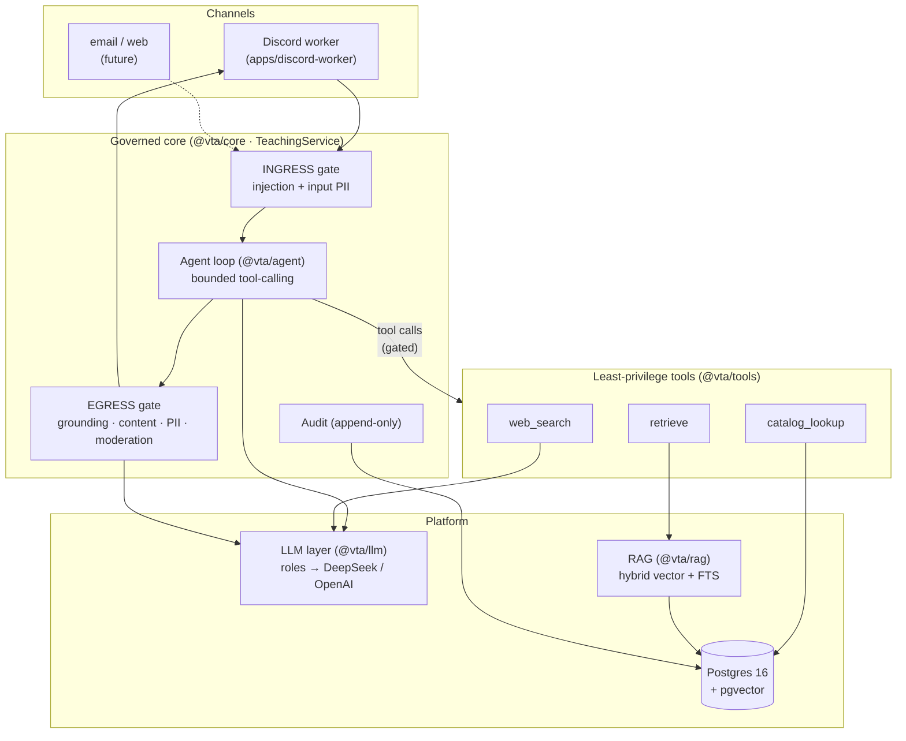
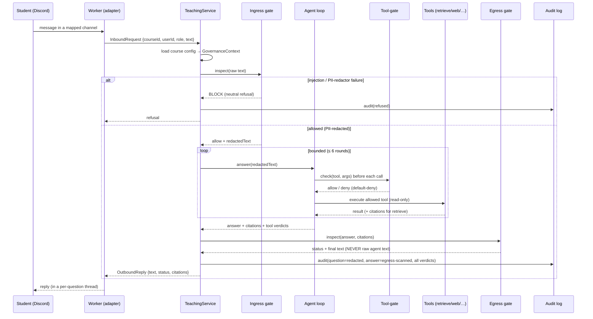
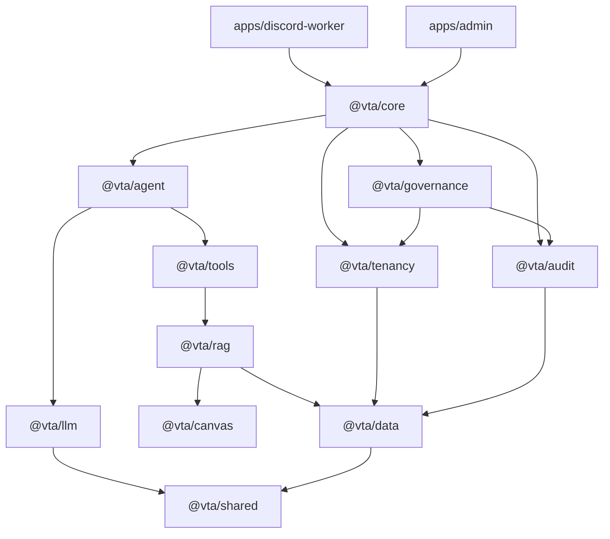
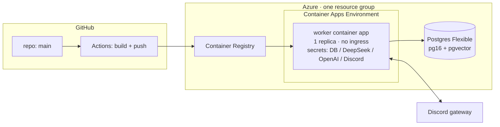

# Virtual Teaching Assistant (VTA)

> A **governed, multi-tenant course Q&A assistant** for Johns Hopkins University — CDHAI.
> It answers students' questions about a specific course on Discord, grounded in
> that course's own materials, behind a structural governance layer that controls
> what the assistant may **read, do, and say**.

**Status:** Deployed on Azure and answering on Discord, currently piloting with a
single course (the design is multi-tenant — more courses/instructors to follow).
Course-material ingestion and a few enhancements remain — see
[Status & roadmap](#status--roadmap).

---

## Table of contents

- [What it is & why](#what-it-is--why)
- [Design principles](#design-principles)
- [System architecture](#system-architecture)
- [Request lifecycle](#request-lifecycle)
- [Governance model](#governance-model-the-three-gates)
- [The swappable brain (LLM layer)](#the-swappable-brain-llm-layer)
- [Tools](#tools)
- [Multi-tenancy](#multi-tenancy)
- [Monorepo & packages](#monorepo--packages)
- [Tech stack](#tech-stack)
- [Local development](#local-development)
- [Operations (admin CLI)](#operations-admin-cli)
- [Deployment (Azure)](#deployment-azure)
- [CI/CD](#cicd)
- [Configuration & secrets](#configuration--secrets)
- [Status & roadmap](#status--roadmap)
- [Conventions](#conventions)

---

## What it is & why

Students ask a lot of repetitive, well-bounded questions about a course
("where's the syllabus?", "what does this concept mean?", "when is assignment 3
due?"). A teaching assistant that can answer those **from the course's own
materials**, at any hour, frees up human staff — *if* it can be trusted not to
hallucinate, leak private data, do a student's graded work for them, or wander
off-topic.

The VTA is built so that trust comes from **structure, not from a prompt**. It
replaces an earlier, framework-heavy prototype (OpenClaw) with a small,
all-TypeScript system whose safety properties live in code paths, tool
allow-lists, and tenant-scoped queries — things a model cannot talk its way past.

**One-paragraph summary.** Every student message is bound to exactly one course
(`course_id` travels with it everywhere). It passes an **ingress** gate (prompt-
injection block + input PII redaction) before the model sees it; is answered by a
**bounded, tool-calling agent** that may only use a few **read-only** tools
(course-material retrieval, a course catalog lookup, and a web search), each
checked by a **default-deny tool-gate** before it runs; and the candidate answer
passes an **egress** gate (grounding, content-boundary rails for grades / homework
/ off-topic, output PII scan, moderation) before a single character is delivered.
Every request writes exactly one **append-only audit record**. The first channel
is **Discord**; email and web come later.

---

## Design principles

1. **Governance is structural, not prompt-based.** Constraints are enforced by
   code at chokepoints — tool allow-lists, `course_id`-filtered queries, gates
   that run regardless of what the model produces. A system prompt can be
   ignored or jailbroken; a removed capability and a scoped query cannot.
2. **Fail-safe (default-deny).** If a detector, judge, or any stage throws, the
   system **refuses / blocks** rather than letting an ungoverned answer through.
   A failure is never an implicit "allow".
3. **Channel-agnostic core.** The orchestrator does not know whether a request
   came from Discord, email, or the web. Adapters normalize input to a common
   `InboundRequest` and render a common `OutboundReply`.
4. **Swappable brain.** No package except `@vta/llm` names a concrete model. The
   agent asks for a logical **role**; the LLM layer resolves it to a provider,
   fails over primary → fallback, and records usage.
5. **Multi-tenant by construction.** A **course is a tenant**. `course_id` is on
   every request, every row, and every query — isolation by structure, not by a
   filter someone might forget.

---

## System architecture



The **worker** is deliberately dumb: it normalizes a Discord message, calls
`TeachingService.handle()`, and posts the returned reply verbatim. **All policy,
reasoning, and retrieval live in the core** — a bug in the adapter cannot bypass
governance because the adapter never sees the model.

---

## Request lifecycle

`TeachingService.handle()` runs a **fixed, never-reordered** pipeline. Egress runs
on every non-blocked reply, and **exactly one audit record** is written on every
terminal path — including unexpected errors.



**Step by step**

1. **Adapter → InboundRequest.** The Discord worker drops bots/DMs/empty
   messages, resolves the owning course from the channel (a message inside a
   thread routes on its **parent** channel), maps the Discord snowflake to an
   internal user UUID, and builds a channel-agnostic request.
2. **Ingress gate** (`@vta/governance`). Runs over the untrusted text *before the
   model*: detects prompt-injection / jailbreak attempts (block) and redacts PII
   from the text the model will see. A detector/redactor error → **block**.
3. **Agent loop** (`@vta/agent`). Our own bounded tool-calling loop (max 6
   rounds). Before **every** tool call it consults the tool-gate inline; it
   captures grounding citations from `retrieve`; if it exhausts the loop it forces
   one final answer with tools disabled. If the whole agent path is unavailable, a
   **static fallback** returns a safe "temporarily unavailable" reply.
4. **Egress gate** (`@vta/governance`). The mandatory last gate. Checks
   **grounding** (when the course requires citations), **content boundaries**
   (grades / full homework solutions / off-topic — deterministic patterns + an
   LLM-as-judge), an **output PII** scan, and a **moderation** seam. The reply's
   text/status/citations come from the egress decision, never the raw model text.
5. **Audit** (`@vta/audit`). One append-only record with the *redacted* question,
   the *egress-scanned* answer, the status, and every verdict from ingress +
   tool-gate + egress. FERPA-aware: raw PII never reaches the log.

---

## Governance model (the three gates)

Governance is enforced at three structural chokepoints. Each is **fail-safe**: an
internal error defaults to deny/refuse, never to allow.

| Gate | Where | Checks | On failure |
| --- | --- | --- | --- |
| **Ingress** | before the model | prompt-injection / jailbreak detection; **input PII redaction** | block with a neutral refusal |
| **Tool-gate** | before every tool call | **default-deny allow-list** (`retrieve`, `catalog_lookup`, `web_search`); optional per-tool arg validation | deny the call |
| **Egress** | before delivery | grounding (citations, when required); content rails (grades / homework / off-topic); **output PII scan**; moderation seam | refuse |

The default detectors are dependency-free heuristics (regex injection signatures,
regex PII redaction) with explicit `TODO(swap)` seams for production-grade
services (e.g. Azure AI Content Safety / Prompt Shields, Microsoft Presidio,
Llama Guard). Because everything is behind an interface, swapping a detector is a
wiring change, not a rewrite.

> **Per-course policy.** Each course carries `ContentRules` (stored as config).
> Academic-integrity gates (`refuseGrades`, `refuseHomeworkSolutions`) are **on**
> by default. `requireCitations` and `refuseOffTopic` default **off** so the
> assistant can also answer general/background questions and use web search — a
> course can opt back into strict, citations-only grounding.

---

## The swappable brain (LLM layer)

`@vta/llm` is the **only** package that names concrete models. Callers ask for a
logical **role**; the router resolves it, authenticates with an API key, fails
over primary → fallback, and records token usage. The chat transport is the
**OpenAI-compatible Chat Completions API**, which serves *both* providers:
OpenAI natively and **DeepSeek** via its OpenAI-compatible endpoint.

| Role | Purpose | Model (current) | Provider |
| --- | --- | --- | --- |
| `agent.primary` | main reasoning / answers | `deepseek-v4-flash` | DeepSeek |
| `agent.fallback` | failover when primary errors | `gpt-5.4-mini` | OpenAI |
| `embed` | retrieval embeddings (1536-dim) | `text-embedding-3-small` | OpenAI |
| `rerank` | listwise rerank (prompt-based stand-in) | `gpt-5.4-mini` | OpenAI |
| `guard.judge` | LLM-as-judge for egress content rails | `gpt-5.4-mini` | OpenAI |

**Web search** reuses the same OpenAI key via OpenAI's **hosted** web search
(Responses API `web_search` tool) — the same provider-hosted approach Claude Code
and Codex use — so no third-party search API or extra credential is needed.

Authentication is **API-key only** (an earlier OAuth/Codex-CLI path was removed).
Keys come from a `SecretsProvider`: environment variables in dev, and Azure
Container Apps secrets in production.

---

## Tools

The agent's entire capability surface — deliberately small, **read-only**, and
tenant-scoped. There is no `send`, write, file, shell, or arbitrary-network tool;
producing the answer is the model's job, **delivering** it is the core's job
(after egress).

| Tool | What it does | Scope |
| --- | --- | --- |
| `retrieve` | hybrid semantic search over the course's materials; returns excerpts **with citations** | this `course_id` only |
| `catalog_lookup` | structured listing of what material exists for the course | this `course_id` only |
| `web_search` | public-web search via OpenAI hosted search; returns a summary with source URLs | public web (no course data) |

---

## Multi-tenancy

A **course is a tenant**, enforced structurally:

- `course_id` is part of every `InboundRequest` / `OutboundReply`.
- It is a column on every tenant-owned table and a predicate on every query —
  `@vta/data` exposes **course-scoped access only**.
- Tenant scope is derived **server-side** (channel → course) and carried in the
  `GovernanceContext`; it is **never** taken from anything the user or model can
  set. `retrieve`/`catalog_lookup` read strictly within `ctx.courseId`.
- A user's Discord snowflake is mapped to an internal `users.id` UUID; roles and
  the audit log key on the UUID, never the raw snowflake.

---

## Monorepo & packages

pnpm + Turborepo workspace, all TypeScript (ESM / NodeNext, `strict` +
`noUncheckedIndexedAccess`).

| Package | Responsibility |
| --- | --- |
| `@vta/shared` | cross-cutting types & primitives: errors, roles, domain types, secrets, env, logger. **No `@vta` deps.** |
| `@vta/data` | Drizzle schema + migrations + course-scoped repositories (Postgres + pgvector). |
| `@vta/llm` | logical roles → concrete providers; OpenAI-compatible transport; OpenAI hosted web search. The only model-naming package. |
| `@vta/tenancy` | channel → course resolution, role lookup, per-course config (`ContentRules`). |
| `@vta/canvas` | read-only Canvas LMS client (course materials → ingestible content). |
| `@vta/rag` | hybrid retrieval: dense (pgvector HNSW) + sparse (Postgres FTS) fused with Reciprocal Rank Fusion. |
| `@vta/tools` | least-privilege read-only tools: `retrieve`, `catalog_lookup`, `web_search`. |
| `@vta/governance` | the three gates (ingress / tool-gate / egress) + default detectors. Structural, fail-safe. |
| `@vta/audit` | append-only, FERPA-aware audit/disclosure log. |
| `@vta/agent` | the bounded, governed tool-calling loop (`PiAgent`) + static fallback. |
| `@vta/core` | composition root + `TeachingService` orchestrator + Canvas ingestion service. |
| `apps/discord-worker` | the Discord channel adapter (gateway client → `handle()` → reply). |
| `apps/admin` | operator CLI: register courses, map channels, set roles, ingest content. |

**Dependency direction** (everything points down toward `@vta/shared`):



---

## Tech stack

- **Language/runtime:** TypeScript 5.9, Node ≥ 20 (CI on 22), ESM / NodeNext.
- **Monorepo:** pnpm 9.15 + Turborepo.
- **Data:** PostgreSQL 16 + `pgvector` (HNSW index) + full-text search (GIN);
  Drizzle ORM; validation with Zod.
- **LLM:** OpenAI SDK transport (OpenAI + DeepSeek); OpenAI hosted web search.
- **Channel:** discord.js (gateway client).
- **Tests:** Vitest. **Lint:** ESLint + typescript-eslint. **Logs:** pino.
- **Cloud:** Azure Container Apps, Postgres Flexible Server, Container Registry;
  IaC in Bicep; CI/CD in GitHub Actions.

---

## Local development

**Prerequisites:** Node 22 (see `.nvmrc`), pnpm via Corepack (`corepack enable`),
Docker (for local Postgres).

```bash
corepack enable                 # use the pinned pnpm version
pnpm install                    # install the workspace
cp .env.example .env            # fill in DEEPSEEK_API_KEY / OPENAI_API_KEY / DISCORD_BOT_TOKEN

pnpm infra:up                   # local Postgres (pgvector) via Docker Compose
pnpm db:push                    # apply the Drizzle schema
pnpm db:indexes                 # create pgvector (HNSW) + FTS (GIN) indexes

pnpm build                      # build all packages (turbo)
pnpm typecheck && pnpm lint && pnpm test
```

| Script | What it does |
| --- | --- |
| `pnpm build` / `typecheck` / `lint` / `test` | build / type-check / lint / Vitest across the workspace |
| `pnpm infra:up` / `infra:down` | start / stop local Postgres (Docker Compose) |
| `pnpm db:push` | apply the Drizzle schema |
| `pnpm db:indexes` | create the pgvector HNSW + FTS GIN indexes (run once after `db:push`) |

To run the worker against the database: `pnpm --filter @vta/discord-worker dev`.

---

## Operations (admin CLI)

`apps/admin` is the operator tool. It talks to the same database the worker uses
(local or cloud — set `DATABASE_URL`). Build once (`pnpm build`), then:

```bash
# Register / refresh a course (re-running RESETS its config + channel map).
node apps/admin/dist/main.js course:add \
  --slug cs101 --name "Intro to Computer Science" --canvas-id <canvas-course-id>

# Bind a Discord channel to the course (the bot only answers in mapped channels).
node apps/admin/dist/main.js course:map-channel \
  --slug cs101 --channel <discordChannelId> [--guild <id>]

# Grant a course role by Discord id (maps snowflake → internal user UUID).
node apps/admin/dist/main.js course:set-role \
  --slug cs101 --discord-id <id> --role <admin|privileged|standard> [--name "Display Name"]

# Ingest the course's Canvas materials into the retrievable store (needs a Canvas token).
node apps/admin/dist/main.js course:ingest --slug cs101

# List all registered courses.
node apps/admin/dist/main.js course:list
```

> The bot replies to **every** non-bot message in a mapped channel (no @mention
> needed), so use a dedicated Q&A channel (e.g. `#ask-the-ta`). Follow-up messages in
> the reply thread are answered too.

---

## Deployment (Azure)

Everything lives in a single resource group. The runtime is one always-on
Container App (a persistent Discord gateway client, so exactly one replica and no
HTTP ingress).



| Resource | SKU | Purpose |
| --- | --- | --- |
| Resource group | — | holds everything |
| Postgres Flexible Server | B1ms · pg16 | RAG store + audit log (pgvector + FTS) |
| Container Registry | Basic | worker image |
| Container Apps Environment | — | runtime (co-located with Postgres) |
| Container App | 0.5 vCPU / 1 GiB · min=max=1 | the always-on bot |

(Actual resource names/regions/ids are kept out of this repo; operators set them
via environment variables / GitHub Actions variables — see `scripts/deploy.local.ps1.example`.)

IaC for the data layer is in `infra/azure/*.bicep`. Two **subscription quirks**
are baked in and worth knowing:

- **Postgres Flexible can be offer-restricted in busy regions** on some
  subscriptions, so the Bicep splits the resource-group region from the database
  region (deploy the DB to a region where the offer is available).
- **pgvector must be created before `db:push`** — Bicep allow-lists the extension
  (`azure.extensions=VECTOR`) but you still run `CREATE EXTENSION vector` (handled
  by `db:indexes`).

Secrets are stored as **Container App secrets** (encrypted, never in the image or
git) and referenced as env vars; `SECRETS_PROVIDER=env`.

### What runs, and what it costs

Five resources make up the deployment; only three carry a meaningful ongoing cost:

| Resource type | Billing model | Ongoing cost |
| --- | --- | --- |
| **Postgres Flexible Server** | compute billed **per hour while running** + storage | the largest variable cost; **stop** it to drop to storage-only |
| **Container App** (always-on worker) | billed per **replica running-time** | a small ongoing cost while a replica is up; **scale to 0** for ≈ none |
| **Container Registry** (Basic) | small **flat** fee; cannot be paused | minor, constant |
| Container Apps Environment (Consumption) | billed via its apps' usage; no fixed fee | ≈ none when the app is scaled to 0 |
| Managed identity | free | none |

(Exact figures depend on region/contract; the relative sizes above are what
matter. No log-analytics workspace is provisioned, so there's no telemetry cost.)

### Pausing when idle (reversible)

When the assistant isn't needed, pause the two compute resources to minimize
spend — no data or configuration is lost:

```powershell
pwsh scripts/pause.ps1     # worker -> 0 replicas (bot offline) + stop Postgres compute
pwsh scripts/resume.ps1    # start Postgres + worker -> 1 replica (bot back in ~30s)
```

These read your resource names from the gitignored `scripts/deploy.local.ps1`.
Equivalent raw commands: `az containerapp update --min-replicas 0` and
`az postgres flexible-server stop` (resume with `--min-replicas 1` /
`flexible-server start`). Note: a **stopped** Postgres Flexible Server is
auto-started by Azure after ~7 days — re-run `pause.ps1` to keep it paused.

---

## CI/CD

`git push` to `main` triggers two GitHub Actions workflows:

- **`ci.yml`** — lint → typecheck → build → test (the quality gate).
- **`build-and-deploy.yml`** — builds the worker image **on GitHub's runners**
  and pushes it to ACR (using ACR admin credentials). This is why **no local
  Docker is needed** — and it sidesteps this subscription's block on server-side
  ACR builds (ACR Tasks).

**Rolling out the new image** is a one-line local command (no Docker), run under
your own `az` login:

```powershell
pwsh scripts/deploy.ps1            # roll the Container App to the latest image
```

> **Why deploy isn't fully automatic (yet).** The JHU tenant blocks this account
> from creating a service principal *and* from assigning roles (it is Contributor,
> not Owner). So CI has no Azure identity allowed to update the Container App. The
> OIDC plumbing is already in place (a federated user-assigned managed identity,
> with the deploy job wired but gated behind the `AUTO_DEPLOY` variable). **To
> enable zero-touch deploys**, a subscription **Owner** runs one role assignment
> for that identity and flips one variable — see `scripts/deploy.local.ps1.example`.
> Until then: `git push` builds & pushes automatically; one local command rolls it out.

---

## Configuration & secrets

Config is validated at startup (`@vta/shared`, Zod). Secret **names** are resolved
by the provider (env var = the UPPER_SNAKE form, e.g. `deepseek.api-key` →
`DEEPSEEK_API_KEY`).

| Variable | Required | Notes |
| --- | --- | --- |
| `DATABASE_URL` | yes | Postgres connection string (`…?sslmode=require` in cloud) |
| `DEEPSEEK_API_KEY` | yes | primary chat model |
| `OPENAI_API_KEY` | yes | fallback chat + embeddings + guard judge + web search |
| `DISCORD_BOT_TOKEN` | yes | the bot needs the **Message Content** privileged intent enabled |
| `DEEPSEEK_BASE_URL` | no | defaults to `https://api.deepseek.com` |
| `LLM_PROFILE` | no | `dev` \| `prod` (same shape; both API-key based) |
| `SECRETS_PROVIDER` | no | `env` (default) \| `keyvault` |
| `LOG_LEVEL` | no | `info` default |
| `CANVAS_TOKEN_<COURSE>` | per course | Canvas API token for ingestion, e.g. `CANVAS_TOKEN_CS101` |

Never commit real secrets — `.env` is git-ignored; cloud secrets live in Container
App secrets / Key Vault.

---

## Status & roadmap

**Live now**
- ✅ Full stack deployed to Azure; Discord bot online and answering in its channel.
- ✅ Governed pipeline end-to-end (ingress → agent → egress → audit), verified
  against the real database and live DeepSeek/OpenAI.
- ✅ General-knowledge answers + OpenAI hosted **web search**.
- ✅ CI builds & pushes images on every push; one-command rollout.

**In progress / next**
- ⏳ **Canvas ingestion** for the pilot course (needs the course's Canvas token) —
  until then answers are general, not grounded in the course's own materials.
- ⏳ **Multi-turn memory** — each question is currently answered independently
  (thread history is not yet fed back to the agent).
- ⏳ **Zero-touch deploy** — pending one Owner-level role grant (see [CI/CD](#cicd)).
- 🔭 **More channels** (email, web) and **more courses/instructors** (the design is
  already multi-tenant).
- 🔭 **Production-grade detectors** swapped in behind the governance ports
  (Content Safety / Presidio / Llama Guard).

See [`ARCHITECTURE.md`](./ARCHITECTURE.md) for the deeper design dive.

---

## Conventions

- **All code, comments, and committed docs are in English.** (Design chats may be
  in other languages; anything in the repo is English.)
- Commit on a branch / open a PR for changes; `main` is protected by CI.

## License

[MIT](./LICENSE) — Copyright (c) 2026 Johns Hopkins University — CDHAI.
