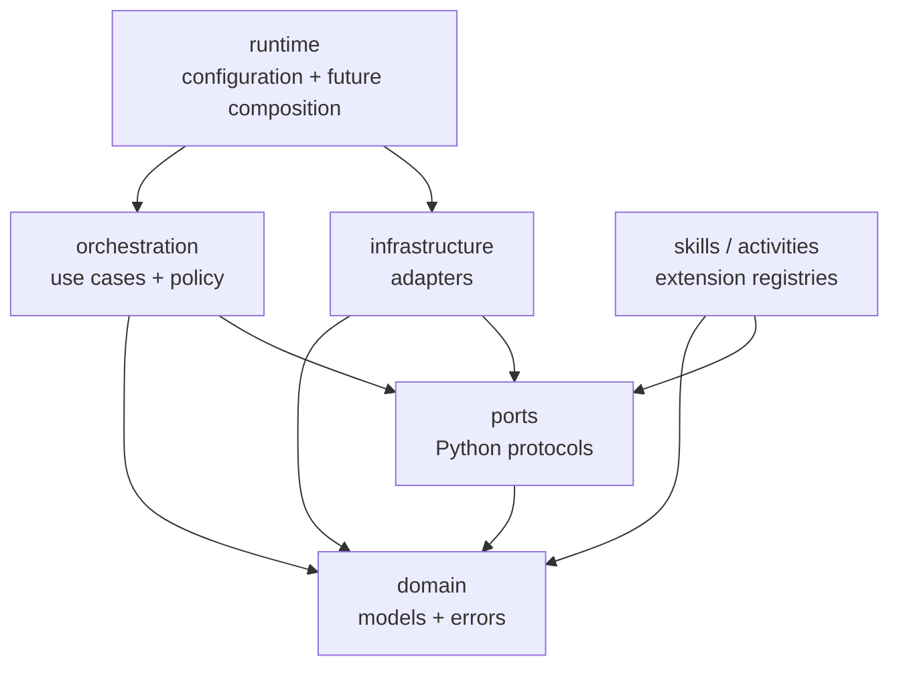

# Component Model

## Architectural style

The V2 code is a modular Python monolith using hexagonal boundaries. Domain and
orchestration code depend on protocols; infrastructure implements or wraps those
protocols. This keeps one-process development simple while preserving extraction
points for high-risk workers and external services.

`scripts/check_architecture.py` rejects imports from domain, ports, or
orchestration into infrastructure, the legacy deployer, or network SDKs.

## Package responsibilities

### `domain/`

Defines the stable language exchanged across adapters:

- actor roles and teaching modes;
- data classifications and agent tiers;
- named capabilities;
- request, response, proposal, approval, attempt, and health records;
- safe exception categories.

Domain records validate their own structural invariants and are frozen. They do
not authenticate a user or establish that a role assertion is true; trusted
ingress must do that before construction.

### `ports/`

Defines runtime-independent Python `Protocol` interfaces for:

- agent backends and a native agent engine;
- communication channels;
- LLM transports;
- approval storage and side-effect execution;
- audit sinks and health probes;
- teaching skills and classroom activities.

Ports define shape, not authorization. Implementations remain subject to policy
and deployment controls.

### `orchestration/`

Owns application decisions:

- `PolicyEngine` computes a reasoning-only capability envelope;
- `CircuitBreaker` tracks backend availability state;
- `FallbackOrchestrator` runs permission-monotonic backend selection;
- `TeachingService` adds minimized interaction auditing;
- `SideEffectCoordinator` manages proposal approval and deterministic execution.

Orchestration does not import provider SDKs or concrete storage.

### `infrastructure/agents/`

- `NativeAgentBackend` delegates to a future Python-native engine.
- `CodexCliBackend` constructs a restricted, non-interactive `codex exec`
  subprocess and parses its JSONL event stream.
- `OpenClawBackend` delegates to a safe client protocol; no CLI prompt argument
  implementation is provided.
- `SubprocessExecutor` bounds time, output, environment inheritance, and process
  termination.

Subprocess restriction is defense in depth, not equivalent to an OS sandbox or
container boundary.

### `infrastructure/auth/`

Separates model transport from the agent runtime. `CredentialFailoverRouter`
selects registered transports using production eligibility, classification,
circuit state, timeout, and retry rules. Concrete adapters cover the official
OpenAI Responses API and optional experimental `codex_oauth` package.

### `infrastructure/approvals/`

Contains a lock-protected process-local approval store for tests and pilots. A
durable database implementation must preserve optimistic concurrency,
idempotency, distinct approvers, auditability, and recovery after executor
timeouts.

### `infrastructure/observability/`

Provides bounded health supervision and minimized audit sinks. It does not yet
export metrics or traces to an operations platform.

### `skills/` and `activities/`

Registries validate extension metadata before registration. The bundled
`course-ta` skill is package data under `course_ta_deployer/skills/course-ta/`
because the legacy installer consumes it. Its V2 manifest declares version,
modes, capabilities, trust, entrypoint, and maximum data class.

### `runtime/`

Currently owns strict platform configuration. A future composition root will
construct channel adapters, stores, policies, backend registrations, transports,
and the external API without moving those decisions into domain code.

## Compatibility package

`course_ta_deployer/` is deliberately outside the V2 dependency direction. It
contains concrete OpenClaw profile generation and Canvas/Discord helper scripts.
New V2 modules must not import it. Migration should happen by implementing V2
ports around reviewed provider behavior, not by calling legacy helpers from the
domain core.

## Extraction boundaries

The modular monolith can later split at high-risk or scaling boundaries:

- channel ingress/API;
- agent workers;
- indexing/retrieval;
- approval and side-effect execution;
- live-class event processing.

Extraction is justified by isolation, deployment ownership, or measured scale,
not by the existence of a protocol alone. See [ADR 0001](../adr/0001-modular-monolith.md).
