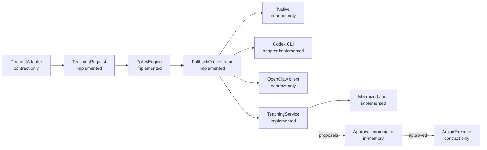
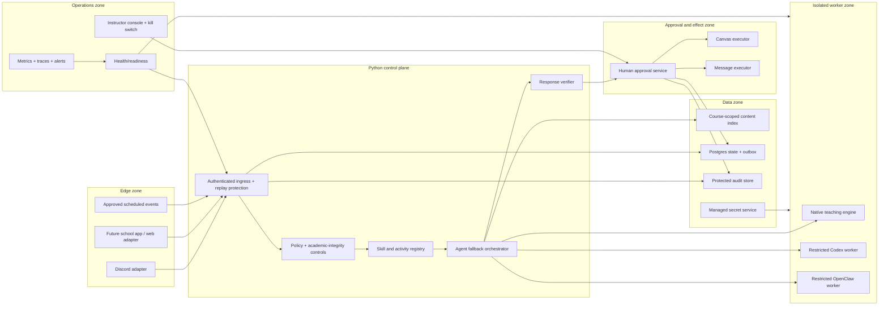

# Architecture Overview

## System intent

VirtualTeachingAssistant is a Python framework for policy-governed,
course-aware teaching agents. It provides a shared domain and orchestration
model around replaceable channels, skills, agent runtimes, model transports,
storage, and external action executors.

The architecture is designed to help professors and students without granting a
general-purpose LLM direct authority over institutional systems. It supports a
path from course Q&A toward reviewed recaps, live-class assistance, and classroom
activities while keeping identity, data policy, approval, and operations outside
the prompt.

The project is a modular monolith today. Deployment operating system is
orthogonal to the Python architecture; Linux is currently documented for the
legacy server scripts and remains a likely institutional hosting target.

## Status legend

- **Implemented:** executable V2 code and automated tests exist.
- **Compatibility:** concrete behavior exists only in `course_ta_deployer`.
- **Contract only:** typed boundary exists without a complete production adapter.
- **Target:** planned architecture, not current runtime behavior.
- **Institutional gate:** depends on Carey/JHU systems or approval.

## Current V2 foundation

This library flow is not exposed through an HTTP server and is not wired to a V2
Discord adapter. The concrete Discord/Canvas/OpenClaw behavior remains in the
compatibility package. See [Current state](current-state.md).

## Target trust zones

Everything in this diagram is a target deployment unless marked as already
implemented in the current-state inventory.

The key trust decision is that agent workers cannot reach side-effect executors
directly. Approval identity, target validation, idempotency, and reconciliation
remain deterministic control-plane responsibilities.

## Core invariants

1. Agent fallback is available only for side-effect-free reasoning.
2. Backend failure may preserve or reduce authority; it may never expand it.
3. A response or action proposal is not authorization or proof of execution.
4. Every request is scoped by tenant and course before agent execution.
5. External content is untrusted data, including Canvas pages, uploads, links,
   transcripts, model output, and provider errors.
6. Highly restricted information never enters a general agent prompt.
7. Personal Codex OAuth is not a production service identity.
8. Audit minimizes content and identity; operational logs do not become a
   shadow store of student conversations.
9. Health checks are bounded and non-mutating.
10. All provider and runtime integrations remain replaceable behind typed ports.

## Agent and transport separation

An agent backend decides how to reason: retrieval, prompt composition, tool
selection, and response structure. An LLM transport decides how one model call
is authenticated and sent. They have separate fallback routers because a native
agent may use the same official model transport as a Codex worker, while a
transport outage should not redefine agent capabilities.

The intended default agent order is native, Codex, then OpenClaw. The official
API transport is the production direction. Experimental personal OAuth is
development-only and rejected by production configuration.

## Side-effect boundary

Agents can produce `ActionProposal` records. A separate coordinator determines
approval count, collects distinct approvers, dispatches only to a typed executor,
and records an external reference. High-risk action types require two people.

The current coordinator and in-memory store demonstrate and test the state
machine. Production requires institutional approver authentication, durable
transactions/outbox, crash recovery, executor-specific validation, and provider
reconciliation.

## Data architecture

Current V2 state is process-local except for optional JSONL audit. The target
design uses:

- course/section namespacing in every key and index;
- durable provider-event idempotency;
- Postgres for authoritative workflow/approval/outbox state;
- object/index storage selected by course-content requirements;
- managed secrets outside application configuration;
- protected audit retention with role-limited access;
- explicit deletion, backup, and restoration policy.

Redis or a queue should be added only when concurrency/load requirements justify
it; it is not an architectural prerequisite for correctness.

## Evolution path

1. Complete institution-neutral V2 ingress, storage, adapters, native-engine
   skeleton, isolation, and observability using synthetic data.
2. Build approved teaching-quality, safety, robustness, cost, and latency evals.
3. Complete institutional identity, privacy, accessibility, vendor, operations,
   and incident-readiness gates.
4. Run one reversible read-only course pilot.
5. Add reviewed recap/activity/effect workflows one at a time.

See [Roadmap](../roadmap.md) for exit criteria and [ADRs](../adr/) for accepted
decisions.
