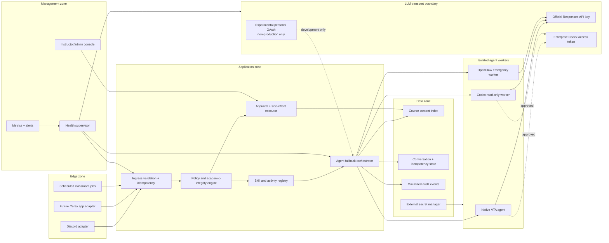

# VirtualTeachingAssistant Architecture

## Purpose

VirtualTeachingAssistant is a multi-course teaching platform for Carey Business
School. It normalizes communication channels, applies institutional policy,
routes read-only reasoning across multiple agent backends, and keeps all side
effects behind explicit authorization and approval boundaries.

This repository begins as a modular monolith. Its ports are process-safe and
network-ready so high-risk components can move into separate services without
rewriting domain logic.

## Trust zones



## Core invariants

1. Agent fallback is allowed only for side-effect-free reasoning.
2. An agent response is a proposal, never authorization to mutate Canvas,
   publish an announcement, message a class, or change configuration.
3. Every external event has a tenant, course, actor, channel, request id, data
   classification, and trace id before it reaches an agent.
4. Backend failure never broadens tool permissions or data visibility.
5. Restricted student data is excluded from prompts unless a reviewed use case
   and an institution-approved provider permit it.
6. Personal Codex OAuth is not a production service credential.
7. Raw prompts, tokens, student messages, grades, and rosters are not written to
   operational logs.
8. All adapters are replaceable behind typed ports.

## Request lifecycle

1. A channel adapter verifies provider authenticity and emits a normalized
   `TeachingRequest`.
2. Ingress validates sizes, identifiers, replay/idempotency keys, and tenant
   routing.
3. Policy computes an immutable capability envelope from role, interaction
   mode, data class, and deployment environment.
4. Skills contribute domain instructions and read-only tools within that
   envelope.
5. The orchestrator tries `native`, then `codex-cli`, then `openclaw`, skipping
   disabled or open-circuit backends.
6. A verifier/policy pass validates the response before channel delivery.
7. Any requested side effect becomes an approval item with an idempotency key.
8. Audit records contain hashes, status, timing, backend, and policy result, but
   no raw student content.

## Module boundaries

```text
virtual_teaching_assistant/
  domain/          Immutable request, response, policy, health, and error types
  ports/           Agent, channel, LLM, skill, audit, and health protocols
  orchestration/   Policy, circuit breakers, fallback, and teaching service
  infrastructure/  Subprocess agents, auth routing, audit, and channel registry
  activities/      Extensible live class, recap, game, and debate contracts
  skills/          Trusted skill manifests and registry
  runtime/         Environment validation and composition
  api/             Future HTTP/event API boundary
```

The legacy `course_ta_deployer` remains a compatibility and migration module.
New domain code must not import it.

## Deployment progression

- **Development:** in-process adapters, fake transports, no student data.
- **Pilot:** one Linux host, separate service account, Discord + read-only
  Canvas, official API key, no automated writes.
- **Controlled production:** reverse proxy, SSO/admin authorization, external
  secrets, Postgres/Redis, isolated agent workers, metrics/alerts, backup and
  incident runbooks.
- **Scale-out:** stateless ingress replicas, durable event/outbox queues,
  isolated agent worker pools, separate indexing and classroom-live services.

Production readiness requires institutional security, privacy, accessibility,
records-retention, procurement, and legal review. The codebase cannot claim
FERPA or institutional compliance by itself.
