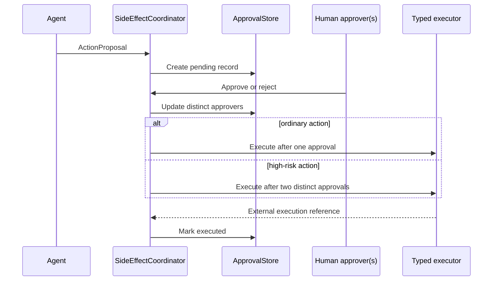

# Request Lifecycle

This document distinguishes the implemented V2 library flow from the trusted
ingress and delivery behavior still required around it.

## 1. Ingress and normalization

**Status: contract only.** A future `ChannelAdapter` must authenticate the
provider event, map an institution-backed actor/course context, reject replay or
oversized input, and construct `TeachingRequest`.

`TeachingRequest` validates:

- reference format for tenant, course, actor, channel, request, trace, and
  idempotency identifiers;
- non-empty content up to 32,768 characters;
- timezone-aware event time;
- at most 32 metadata entries with bounded key/value lengths.

These structural checks do not verify Discord signatures, SSO claims, course
membership, or role truth. Those are ingress responsibilities not implemented
by the V2 package.

## 2. Policy evaluation

**Status: implemented.** `PolicyEngine` combines the actor role, interaction
mode, requested capability set, and data classification.

It denies:

- every highly restricted request;
- student-originated restricted data;
- administrative mode for anyone other than instructor/administrator;
- requested capabilities outside the actor's role.

It then intersects role and mode capabilities and removes `discord.send`,
`canvas.write`, and `config.write`. The resulting envelope always sets
`side_effects_allowed=False`.

## 3. Backend selection and fallback

**Status: implemented as a library.** Registrations are sorted by `AgentTier`.
For each backend the orchestrator:

1. skips disabled registrations;
2. skips a backend below the request's data classification;
3. skips open circuits;
4. intersects the policy envelope with backend capabilities/data ceiling;
5. requires the remaining envelope to contain `reason`;
6. invokes with a per-backend timeout;
7. records a bounded attempt result.

### Failure behavior

| Failure | Circuit failure | Try next backend | Reason |
|---|---:|---:|---|
| Authentication, retryable | Yes | Yes | Credential/backend availability problem |
| Rate limit, retryable | Yes | Yes | Capacity problem |
| Timeout | Yes | Yes | Bounded availability problem |
| Unavailable/internal, retryable | Yes | Yes | Backend health problem |
| Invalid request | No | No | Retrying elsewhere can hide a caller defect |
| Policy denial | No | No | A backend cannot override platform policy |
| Content safety | No | No | Fallback must not become a safety bypass |
| Non-retryable backend error | No | No | Deterministic failure |

If no backend completes, `NoBackendAvailable` contains backend names/attempt
status but no prompt content.

## 4. Backend execution

The current concrete V2 backend with process execution is `CodexCliBackend`.
It sends the prompt over stdin, not the command line, and requests ephemeral,
read-only, ignored-user-config operation. Native and OpenClaw V2 execution depend
on injected protocols and have no production implementation in this repository.

An agent can return text, citations, model/usage metadata, and typed action
proposals. The current service does not yet implement a separate semantic output
verifier; policy and schema checks are the implemented boundary.

## 5. Response and audit

**Status: implemented.** `TeachingService` returns `TeachingResponse` with the
selected backend, tier, degraded flag, attempts, citations, proposals, and model.

It records an audit event containing:

- event type, time, request/trace/tenant/course references;
- an HMAC digest of the actor reference;
- backend/tier/degraded status;
- input/output character counts;
- HMAC content digest;
- attempt and proposal counts;
- safe exception type on failure.

Raw request content, raw actor reference, response text, and tokens are absent.

## 6. Delivery

**Status: contract only in V2.** A channel adapter is responsible for bounded,
idempotent delivery and safe user-facing errors. The legacy OpenClaw path has
Discord delivery helpers, but those are not called by `TeachingService`.

## 7. Side-effect proposal and approval

**Status: implemented coordinator with in-memory storage.** An agent response can
contain `ActionProposal`, but the agent cannot execute it.

Students cannot submit side effects. Grade, enrollment, assessment publication,
and bulk-message actions require two distinct approvers. Execution uses the
approval ID as the idempotency key and returns the prior record after success.

Production still requires durable transactions/outbox, authorization of
approver identities, crash recovery, action-specific validators, and
reconciliation with Canvas/Discord.
