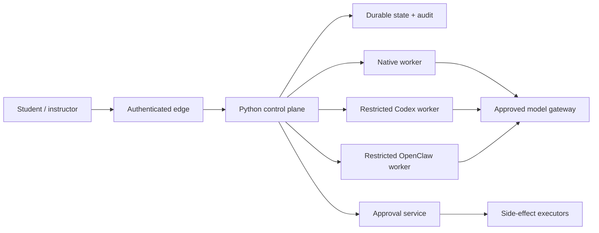

# Deployment Overview

Deployment is an adapter/infrastructure concern, not the identity of the Python
framework. The code can be developed and tested on any environment supporting
Python 3.11; concrete server guidance currently focuses on Linux because the
legacy shell/OpenClaw service workflow targets it.

## Profiles

### Local library development

- Editable Python installation.
- Fake backends/transports/stores.
- Synthetic course and identity data only.
- No network provider requirement.
- Purpose: domain, policy, orchestration, adapter, and eval development.

### Legacy compatibility sandbox

- Original `course_ta_deployer` and OpenClaw profile.
- Concrete Discord, Canvas sync, material indexing, and gateway setup.
- Owner-only environment/profile files.
- Purpose: preserve and study the current Course TA behavior while V2 adapters
  are built.

This profile does not become V2 simply because both packages are installed.

### Controlled V2 integration environment

**Not yet assembled in this repository.** It should add:

- authenticated ingress and a concrete channel adapter;
- official, sandbox-scoped model and Canvas credentials;
- durable event idempotency and approval state;
- isolated Codex/OpenClaw workers when enabled;
- external audit/metrics/alerts;
- synthetic or institution-approved de-identified course fixtures;
- deterministic teardown and credential rotation.

### Institutional pilot

**Institutional gate.** A pilot must be explicitly approved, course-scoped,
human-supervised, reversible, and instrumented. Start read-only with no automated
external writes. See [Roadmap](../roadmap.md).

## Target deployment boundaries

Workers and executors should use separate non-root identities, credential sets,
filesystem roots, network policy, resource limits, and deployment ownership.
The control plane should not hold database-admin, Canvas-write, and model-worker
credentials simultaneously.

## Production configuration is a gate, not a deployment

`VTA_STAGE=production` activates fail-closed configuration checks. It does not
install a reverse proxy, database, queue, secret manager, sandbox, monitoring,
backup system, or SSO. Operators must not set isolation assertions until those
controls exist and have been tested.

## Promotion criteria

1. Reproducible signed build and dependency inventory.
2. All repository gates and approved model eval thresholds pass.
3. Provider sandbox integration and failure-injection tests pass.
4. Identity/RBAC, secrets, durable state, audit, backup, and incident procedures
   are implemented and reviewed.
5. Privacy, security, accessibility, retention, procurement, and teaching-owner
   approvals are recorded.
6. Rollback, kill switch, and human escalation are exercised.

## Rollback

Deployment design must support disabling a channel/agent/transport independently,
returning to read-only/manual teaching support, revoking credentials, draining
pending actions, and restoring durable state without relying on an agent.

For the existing compatibility script, see [Legacy Linux deployment](../linux-server.md).
